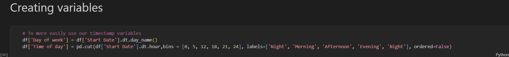
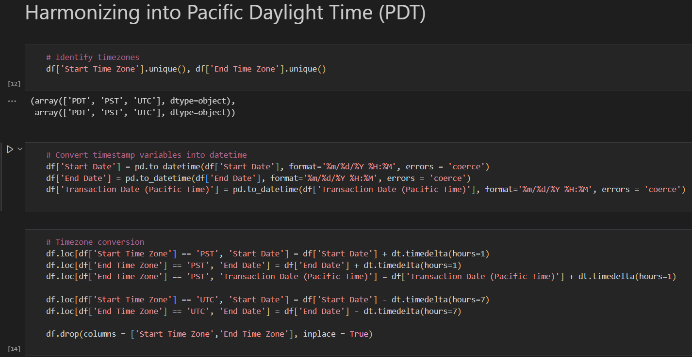
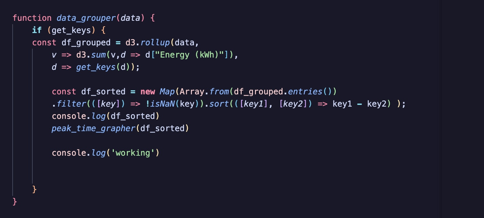

# Weekly Progress Log

### **Week 1, starting 20 Feb** :   
We first started by setting up the GitHub repository and creating a README.md. We then proceeded to choose a dataset under the theme mobility and climate change. In order to ensure that our choice was correct, we spent time “getting to know” the data making sure it matched our project goals, defining the problem statement, target audience and deciding on the different types of visualizations we wanted to create.

### **Week 2, starting 27 Feb** :   
We have started the exploratory data analysis (EDA). We started off by cleaning the data such as dealing with the missing values. While working on the EDA, we were also brainstorming ideas for visualizations, in order to know which variables of the data would give valuable insights.

### **Week 3, 5 Mar** :  
We have finished the first version of the EDA. We have created 2 new variables which are “Day of week” and “Time of day” in order to help us analyze peak times, and create out of it most of our visualizations.   
  
In order to create these 2 variables, we first had to process the date and time variables such as harmonizing into Pacific Daylight Time etc…
    

### **Week 4, 12 Mar** :    
Following the tutorial we had in class on EDA, we improved ours by for instance imputing missing values instead of eliminating the row, addressing the outliers which improved histogram results, and adding a geospatial plot. This additional time has also allowed us to enhance our analyses making them more fit for our future visualizations.
During this week, we also started sketching the visualizations.

### **Week 5, 19 Mar** :  
We have finished the sketches and started thinking about their implementation.
Additionally, we learned D3.js using the tutorials that are on the GitLab.
In our EDA, when looking to identify the time of day where energy consumption was the highest, we grouped the Start Date of the charging session by hour and then summed up the energy consumption. We now realize that it is more accurate to group the End Date because it is the actual moment where the energy was consumed. Indeed, this was not an arbitrary decision as the change produced a different curve.   
   
The decision uncovered another mishap in the EDA. When converting the dates, originally in strings, into datetime objects with pd.to_datetime, we used the argument errors=’coerce’ which produced null values in the End Date column. So we removed rows containing them to proceed.

### **Week 6, 27 Mar** :  
During this final week we completed the visualizations using D3.js, completed the process book and finally built the entire website, making sure we could navigate between the pages.

### **Weekend 28-31 Mar** :   
Final touches on the project, prepared for the oral presentation and did the peer evaluation for group 9.
