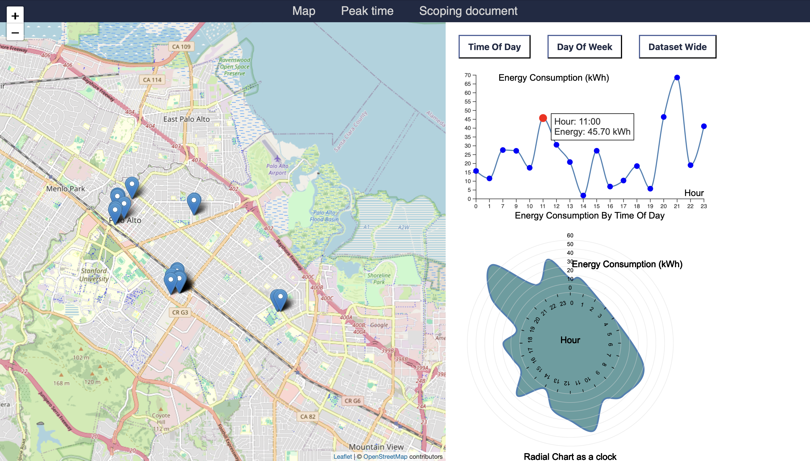

# EV-Charging-Station-Visualization

## Description

Cars and vans accounted for 48 percent of global transport carbon dioxide emissions in 2022, according to an [analysis by Statista](https://www.statista.com/statistics/1185535/transport-carbon-dioxide-emissions-breakdown/) based on International Energy Agency data.

We can reduce carbon emissions by switching to electric vehicles (EVs) but it is not a perfect solution. Thus, our project aims to create visualizations for improving an aspect of EVs. In our case, we choose to tackle EV charging infrastructure, particularly how we can better prepare the electric grid to handle demand from EV charging and how we can improve the placement of charging stations.

## Preview

## Requirements

One of the following:
- One of the following options to run a local web server:
  - **Python 3** (for using a local HTTP server), or
  - **Visual Studio Code** with the **Live Server** extension installed

Due to the size of the dataset, the project does not function when deployed on GitHub Pages nor directly on your browser.

## Documentation

[Progress Log](https://github.com/sayboud/EV-Charging-Station-Visualization/blob/main/Progress_Log.md#progress-log) and 
[Scoping Document](https://github.com/sayboud/EV-Charging-Station-Visualization/blob/main/Scoping_Document.md)

## Credits

EV Charging Station Usage Dataset from [Palo Alto Open Data](http://data.cityofpaloalto.org/dataviews/257812/electric-vehicle-charging-station-usage-july-2011-dec-2020/), an initiative undertaken by the city of Palo Alto, California, aimed at promoting transparency, accountability, and innovation through the provision of accessible and comprehensive datasets to the public. 

